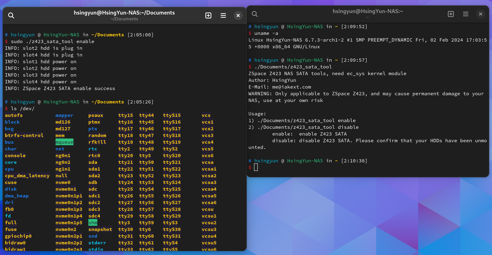

# 极空间 ZSpace Z423 的小工具

极空间 `Z423` 相关工具，随缘更新，不保证可用，仅适用于`Z423`，其他型号的设备使用可能导致设备损坏。

仅共享给知道自己要做什么的童鞋，如果不知道这些工具的作用，那么请勿使用。

**声明**：部分工具会直接操作硬件，可能会造成硬件永久损坏和丧失保修，本人不承担任何责任，请知悉。

**重申**：如果不知道这些工具的作用，那么请勿使用


## 1. Z423 Sata Tool

众所周知，极空间`Z423`默认的SATA口在第三方系统是不开启的。

这里提供一个用户空间工具，供用户在第三方 `linux` 系统下打开或者关闭 `SATA` 控制器，强依赖 `ec_sys` 内核模块（允许写操作）。如果不知道怎么加载内核模块，请勿使用本工具，本工具需要 `root` 权限。

### 使用方式

```shell
# ./z423_sata_tool
ZSpace Z423 NAS SATA tools, need ec_sys kernel module
Author: HsingYun
E-Mail: me@iakext.com
WARNING: Only applicable to ZSpace Z423, and may cause permanent damage to your NAS, use at your own risk

Usage:
1) ./z423_sata_tool enable
2) ./z423_sata_tool disable
        enable:  enable Z423 SATA
        disable: disable Z423 SATA. Please confirm that your HDDs have been unmounted.
```

### 第三方系统截图（例如 ArchLinux）



---

注1：本工具并不保证对任何机器都生效，仅在我自己的设备测试过，可能存在不可预知的 `bug`，也可能导致硬件损坏，因为使用该工具导致的任何风险本人不承担任何责任，如不同意上述声明，请勿使用

注2：后续可能会提供对应的内核patch或者内核模块吧，随缘折腾

注3：该工具会导致LED指示灯显示不正常，后续可能会修复（因为无关紧要，所以可能懒得折腾）

注4：开启后请关注机器风扇的运行情况
